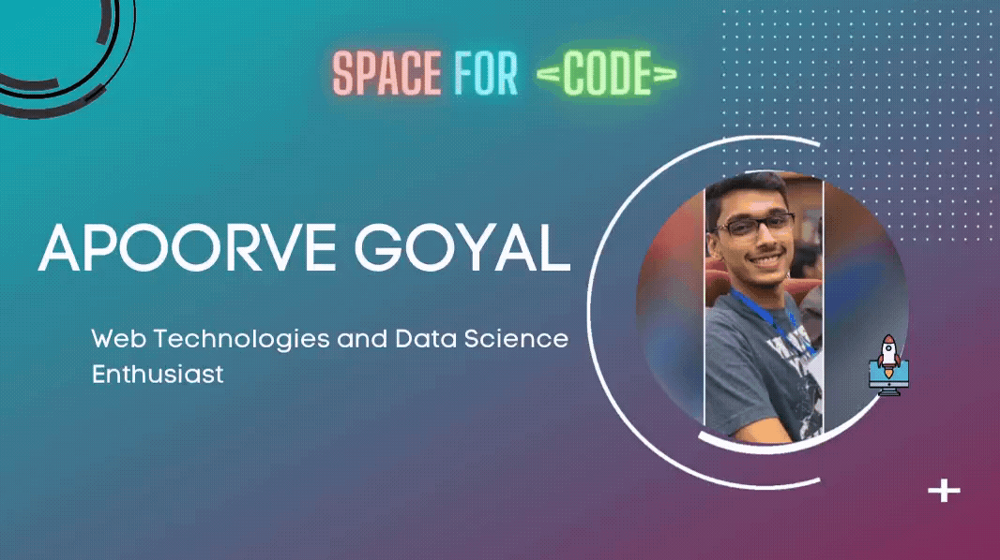

### Hi there 👋, I am

We have made our way to SPACE For exploring a new space, with CODE (such as [BURN_BABY_BURN](https://github.com/chrislgarry/Apollo-11) and [POWER OF TEN](https://en.wikipedia.org/wiki/The_Power_of_10:_Rules_for_Developing_Safety-Critical_Code#:~:text=The%20Power%20of%2010%20Rules,to%20review%20or%20statically%20analyze.) ) that had once started with a simple "HELLO WORLD" program.

## I am,
 A person who believes in the *POWER OF CODE* to explore the hidden dimensions of **The Universe**!

<👨‍💻/> A Quick Learner and a *Developer* who is **Pythonic, Web Technologies and Data Science Enthusiast**.

✨ Astronomy also counts in my Passion

👨‍🎓 ***Founder*** @L-ByDo {learningbydoing} Community, ***Core Team*** Memeber @TesseractCoding and @PythJS
<!--
**Apoorve73/Apoorve73** is a ✨ _special_ ✨ repository because its `README.md` (this file) appears on your GitHub profile.

Here are some ideas to get you started:

- 🔭 I’m currently working on ...
- 🌱 I’m currently learning ...
- 👯 I’m looking to collaborate on ...
- 🤔 I’m looking for help with ...
- 💬 Ask me about ...
- 📫 How to reach me: ...
- 😄 Pronouns: ...
- ⚡ Fun fact: ...
-->
